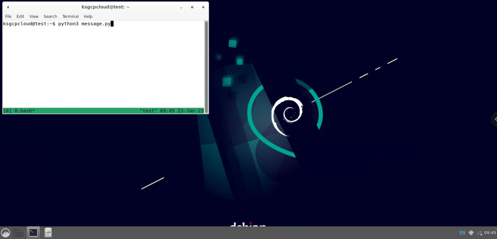
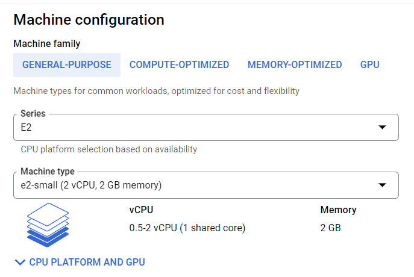
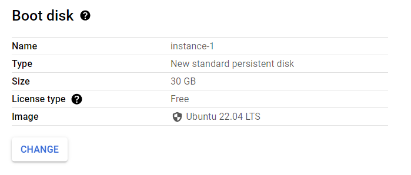
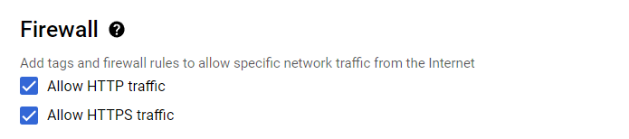
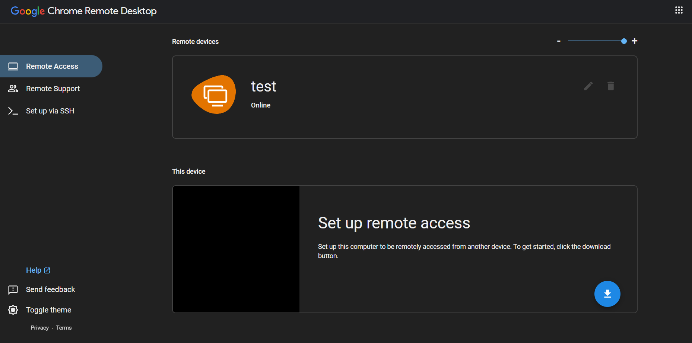
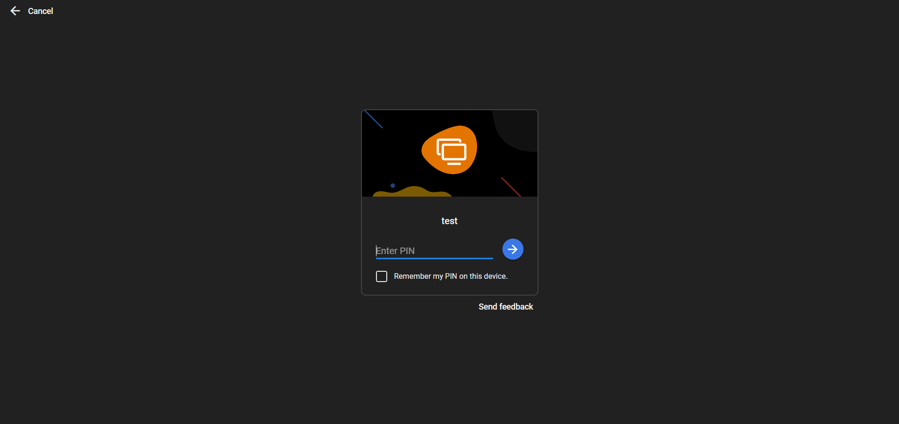
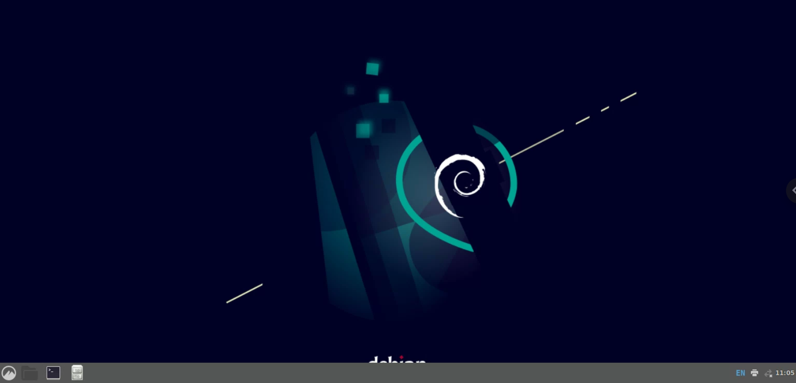

# Project-3 ChatGPT Whatsapp Automation


## About the project-
This project uses Google Cloud VM, ChatGPT and Whatsapp to generate messages that you wish to periodically send to your loved ones from your own phone number (not a test phone number). You just need to login to your Whatsapp account on a browser using Whatsapp Web and the rest is taken care care automatically. You can conveniently schedule the frequency of your messages using the schedule library in python. Hope you implememnt this project and enjoy it too✌️.

## Tools used - 
1. Google Cloud Ubuntu VM using Cinnamon desktop environment
2. Python with openai, schedule and pywhatkit libraries

## Lets launch the project...yaay🥳-

1. Login to your GCP account and create a VM with the following settings👇





2. Now we will install Cinnamon desktop environment and set up Chrome RDP for our VM. To do this follow the steps mentioned in this [link](https://cloud.google.com/architecture/chrome-desktop-remote-on-compute-engine#cinnamon). Do not forget to install Google Chrome.
3. Click on this [link](https://remotedesktop.google.com/access) you will see your VM's name here. Click on it and enter your password that you set during the RDP setup process.




4. You will see a desktop screen like this👇



5. Open Google Chrome in the Cinnamon desktop, browse to whatsapp web and login your whatsapp account there
6. Python is already installed on this ubuntu version. Let's install python pip which helps in installing python libraries. Click on the terminal icon on the left corner to open the terminal window and enter the following command.
```
sudo apt-get install python3-pip
```
7. Now lets install the required python libraries one by one - 
```
sudo pip3 install pywhatkit
sudo pip3 install openai
sudo pip3 install schedule
```
8. Install tkinter using the following command - 
```
sudo apt-get install python3-tk python3-dev
```
9. Now it's time to run our python code😇. Enter the following command to create a python file named message.py - 
```
sudo vim message.py
```
10. Copy the code given in script.py python file here in the repository and press I to enter insert mode in vim. Paste the code into the message.py python file. Enter the receiver's phone number, schedule time and your openAI access token in message.py file (You can get you openAI access token from [here](https://beta.openai.com/account/api-keys))
11. We need the program to run even after we exit the rdp window that's why we will use tmux. Enter tmux into the terminal to enter the tmux window.
```
tmux
```
12. Enter the following command to run the python file in the tmux window - 
```
python3 message.py
```
13. To exit the tmux window press Ctrl + B and then D.
14. Back to the terminal window hun?😏 Congrats. Now see the project run at your scheduled time. You can safely exit you Chrome RDP window also✌️.
15. To kill the tmux process enter the following command in the terminal- 
```
tmux kill-session
```
